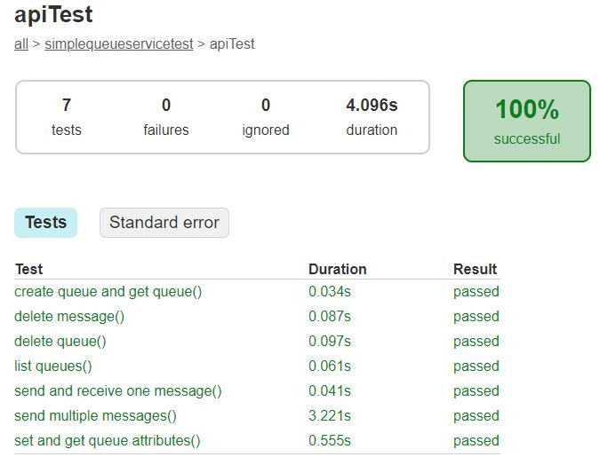
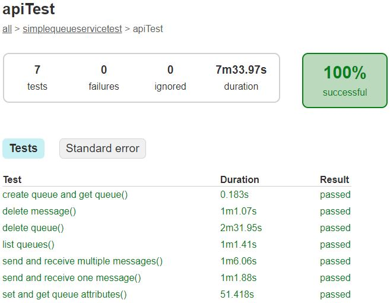

# Introduction
This is sample test suite demonstrates basic test scenarios for testing AWS SQS APIs. It supports to run tests
against a local Elastic MQ server as well as a real AWS SQS endpoint.

# Test Scope
* All AWS SQS functions.

# Test Strategy
* Utilise AWS SDK as client side to interact with server side, all types of API calls should be covered.
* Host Elastic MQ server locally and mock responses for all possible scenarios. 
* May also need to test APIs by direct HTTP requests.

# How To Run Tests

* Prerequisites: JDK 1.8
* AWS account for AWS SQS tests

## Run Tests Against Elastic MQ

```
gradlew test -DqueueType=elasticmq
```

## Run Tests Against AWS SQS

region and credentials shall be configured in local.

```
gradlew test -DqueueType=aws
```

# Test Report

Test report will be generated to `build/reports/tests/test/index.html` file after test execution.

* With Elastic MQ

    

* With AWS SQS

    

# Key Dependent Libraries
* Junit 5
* AWS SDK for Simple Queue Service
* Elastic MQ

# To Do
* Extract common test functions into utility class
* Add Spring's dependency injection function
* Upgrade to Allure test report
* Refactor with JUnit 5 annotation features
* Test Cases
    * More operation APIs test cases to be covered (e.g. AddPermission...)
    * More test cases to be covered for error handling scenarios (Exception APIs)
    * Performance test scenario may also be considered


# AWS APIs Reference
* https://docs.aws.amazon.com/zh_cn/AWSSimpleQueueService/latest/APIReference/API_Operations.html
* https://docs.aws.amazon.com/zh_cn/AWSSimpleQueueService/latest/APIReference/API_Types.html
* https://docs.aws.amazon.com/zh_cn/AWSSimpleQueueService/latest/APIReference/CommonParameters.html
* https://docs.aws.amazon.com/zh_cn/AWSSimpleQueueService/latest/APIReference/CommonErrors.html